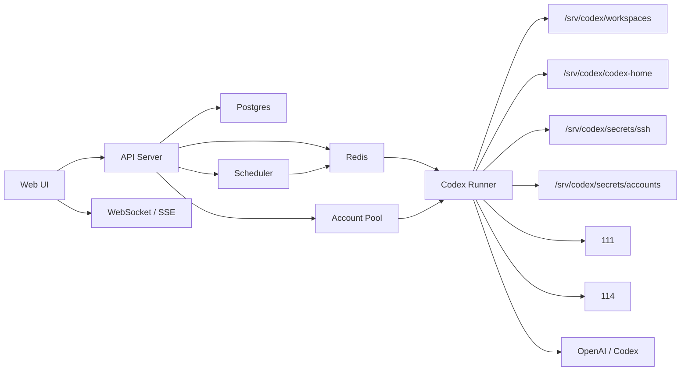

# Server Codex Design

## Goal

Build a private Codex web console on server `150`.

The system should provide:

- A browser UI similar to Codex chat threads.
- Multiple independent threads.
- Server-assigned thread workspaces.
- Editable thread display names.
- Skills and plugins support.
- Scheduled tasks.
- SSH operation from `150` to servers `111` and `114`.
- Multiple authorized Codex/OpenAI accounts with safe failover when an account is unavailable or out of capacity.

This system is not intended to bypass provider limits. Account switching is only for authorized accounts and normal operational failover.

## Server Roles

| Server | Alias | Role |
| --- | --- | --- |
| `111` | `ecs-111` | Managed production host |
| `114` | `ecs-114` | Managed production host |
| `150` | `ecs-150` | Web console, runner host, SSH control node |

`150` is the control plane. It hosts the web application, database, queue, scheduler, Codex runners, secrets, and thread workspaces.

## High-Level Architecture



## Recommended Stack

MVP:

- Frontend: Next.js, React, TypeScript.
- API: Node.js with Fastify or NestJS.
- Database: Postgres.
- Queue: Redis and BullMQ.
- Streaming: SSE for simple one-way model output, WebSocket later if bidirectional control is needed.
- Runner: isolated Node worker process that spawns Codex CLI or calls the OpenAI API.
- Deployment: Docker Compose on `150`.
- Reverse proxy: Caddy or Nginx.

Start with Codex CLI mode for MVP because it can reuse local Codex behavior, skills, plugins, and shell execution more quickly. Add direct API mode later when more control is needed.

## Directory Layout On 150

```text
/srv/server-codex/
  app/
  docker-compose.yml
  .env

/srv/codex/
  workspaces/
    thr_01.../
  codex-home/
    users/
      usr_01.../
    accounts/
      acct_01.../
  plugins/
    global/
    users/
  logs/
  artifacts/
  secrets/
    ssh/
    accounts/
```

The web UI can rename threads, but filesystem paths must remain stable IDs generated by the server.

## Core Domain Model

### Users

```text
users
  id
  email
  display_name
  password_hash
  role
  created_at
```

### Threads

```text
threads
  id
  user_id
  display_name
  workspace_path
  account_mode       auto / pinned / pool
  pinned_account_id
  model
  status             idle / running / waiting_for_capacity / failed / archived
  created_at
  updated_at
```

### Messages

```text
messages
  id
  thread_id
  role               user / assistant / system / tool
  content
  metadata_json
  created_at
```

### Runs

```text
runs
  id
  thread_id
  user_id
  account_id
  status             queued / running / succeeded / failed / canceled
  error_code
  error_message
  started_at
  finished_at
```

### Server Profiles

```text
server_profiles
  id
  name               111 / 114 / 150
  host_alias         ecs-111 / ecs-114 / local-150
  enabled
  allowed_commands_json
  created_at
```

### Audit Logs

```text
audit_logs
  id
  user_id
  thread_id
  run_id
  action
  target
  command
  exit_code
  output_ref
  created_at
```

## Thread Workspace Design

When a thread is created:

1. Generate a thread ID, for example `thr_01HY...`.
2. Create `/srv/codex/workspaces/thr_01HY...`.
3. Store user-editable `display_name` in Postgres.
4. Never derive the directory name from the user-visible name.

Each run executes with:

```bash
WORKDIR=/srv/codex/workspaces/{threadId}
CODEX_HOME=/srv/codex/codex-home/accounts/{accountId}
GIT_SSH_COMMAND="ssh -F /srv/codex/secrets/ssh/config"
```

Use a per-thread lock so only one run can mutate a workspace at a time.

## SSH Control From 150 To 111 And 114

Do not copy the whole local `~/.ssh` directory to `150`.

Preferred approach:

1. Generate a dedicated operations key on `150`.
2. Add its public key to `111` and `114`.
3. Store only that key under `/srv/codex/secrets/ssh`.

Fallback approach:

Copy only the existing `111` and `114` private keys from the local machine to `150`.

Expected SSH config on `150`:

```sshconfig
Host ecs-111
  HostName 43.155.136.111
  User ubuntu
  IdentityFile /srv/codex/secrets/ssh/ubuntu_43.155.136.111
  IdentitiesOnly yes
  StrictHostKeyChecking yes

Host ecs-114
  HostName 43.155.163.114
  User ubuntu
  IdentityFile /srv/codex/secrets/ssh/ubuntu_43.155.163.114
  IdentitiesOnly yes
  StrictHostKeyChecking yes
```

Permissions:

```bash
sudo chown -R codexsvc:codexsvc /srv/codex/secrets/ssh
sudo chmod 700 /srv/codex/secrets/ssh
sudo chmod 600 /srv/codex/secrets/ssh/config
sudo chmod 600 /srv/codex/secrets/ssh/*
```

The runner should log every SSH command in `audit_logs`.

## Account Pool

The account pool stores authorized Codex/OpenAI accounts and selects one for each run.

```text
codex_accounts
  id
  label
  email_masked
  plan_type          free / plus / pro / api / unknown
  status             active / exhausted / disabled / invalid
  priority
  current_5h_usage
  current_week_usage
  reset_5h_at
  reset_week_at
  last_used_at
  secret_ref
  created_at
  updated_at
```

Supported credential modes:

1. API key mode.
   - Preferred for direct API runners.
   - Store encrypted keys server-side.
   - Frontend never displays full secrets.

2. Codex home mode.
   - Useful for CLI runners.
   - Import only required Codex login/config files.
   - Store each account under an isolated `CODEX_HOME`.

Account selection strategy:

1. Use a pinned account if the thread requires it.
2. Otherwise select from active accounts.
3. Prefer higher priority accounts.
4. Prefer accounts with lower current usage.
5. Keep the same account for a thread when practical.

Failover triggers:

- Authentication failed.
- Account disabled.
- Quota/capacity exhausted.
- Rate limited with an explicit retry-after or reset time.
- CLI/API returns a known capacity error.

Failover behavior:

1. Mark the current account status and reset time if known.
2. Write an audit event.
3. Select the next available account.
4. Retry the run only when safe.
5. If no account is available, mark the thread as `waiting_for_capacity`.

Do not use account switching to bypass platform limits. The UI should describe this as authorized account failover.

## Skills

Skills are stored under `CODEX_HOME`:

```text
/srv/codex/codex-home/accounts/{accountId}/skills/
/srv/codex/codex-home/users/{userId}/skills/
```

Web UI features:

- List installed skills.
- Install from a Git repo or uploaded folder.
- View `SKILL.md`.
- Enable or disable skills.
- Show which skills were available for a run.

MVP can start with filesystem-backed skill management. Later add database metadata.

## Plugins

Plugins are stored as:

```text
/srv/codex/plugins/global/
/srv/codex/plugins/users/{userId}/
```

Web UI features:

- List installed plugins.
- Enable or disable per user.
- Configure MCP servers.
- Show plugin-provided skills and tools.
- Audit plugin execution.

Plugin enablement should be explicit because plugins may expose tools, MCP servers, or external access.

## Scheduled Tasks

```text
automations
  id
  user_id
  name
  cron_expr
  timezone
  target_thread_id
  create_new_thread
  prompt
  enabled
  last_run_at
  next_run_at
  created_at
  updated_at
```

Scheduler behavior:

1. Poll due tasks.
2. Enqueue a run.
3. Use the target thread or create a new thread.
4. Respect per-thread locks.
5. Persist result and output.
6. Retry only according to task policy.

Examples:

- Daily status check on `111`.
- Weekly deployment verification on `114`.
- Monitor a saved runner and report if unhealthy.

## Web UI

Main pages:

- Threads.
- Thread detail.
- Files for current workspace.
- Runs and logs.
- Servers.
- Accounts.
- Skills.
- Plugins.
- Automations.
- Settings.

Thread UI:

- Left sidebar thread list.
- Inline rename.
- New thread.
- Archive thread.
- Message composer.
- Streaming assistant output.
- Tool and command timeline.
- Run cancel button.

Accounts UI:

- Account count.
- Current account.
- Plan badge.
- Status.
- Usage meters.
- Reset time.
- Import account.
- Disable account.
- Manual switch.
- Smart failover toggle.

Servers UI:

- `111`, `114`, `150` profiles.
- Connectivity check.
- Last successful command.
- Allowed command policy.
- Audit log.

## Security

Minimum requirements:

- HTTPS.
- Login required.
- Server-side session or JWT.
- Secrets never returned to the browser.
- SSH private keys owned by `codexsvc` and mode `0600`.
- Account secrets encrypted or isolated in filesystem directories with strict permissions.
- Per-thread workspace locks.
- Command and SSH audit logs.
- Optional command approval for dangerous operations.

Runner isolation:

- Run as non-root.
- Prefer a separate container for runner jobs.
- Mount only the required workspace and secret paths.
- Set CPU and memory limits.
- Keep deployment scripts pull-based.

## Deployment On 150

Initial setup:

```bash
sudo useradd -m -s /bin/bash codexsvc
sudo mkdir -p /srv/server-codex /srv/codex/{workspaces,codex-home,plugins,logs,artifacts,secrets/ssh,secrets/accounts}
sudo chown -R codexsvc:codexsvc /srv/server-codex /srv/codex
sudo chmod 700 /srv/codex/secrets
```

Deploy app:

```bash
cd /srv/server-codex
git pull --ff-only
docker compose up -d --build
```

Suggested services:

```text
web
api
runner
scheduler
postgres
redis
caddy
```

## MVP Phases

### Phase 1: Console Foundation

- Docker Compose.
- Next.js shell UI.
- API service.
- Postgres schema.
- Redis queue.
- Login.
- Thread create/list/rename/archive.
- Workspace auto-allocation.
- Message streaming.
- Basic runner abstraction.

### Phase 2: 150 Operations Node

- SSH secrets setup script.
- Server profiles for `111`, `114`, `150`.
- Connectivity checks.
- SSH command audit.
- Thread tools can call `ssh ecs-111` and `ssh ecs-114`.

### Phase 3: Account Pool

- Account import model.
- Manual account switching.
- Per-thread pinned account.
- Active/disabled/exhausted status.
- Safe automatic failover.
- Account usage and reset metadata.

### Phase 4: Skills And Plugins

- Skill listing and import.
- Plugin listing and enablement.
- Per-account/per-user `CODEX_HOME`.
- Run metadata records enabled skills/plugins.

### Phase 5: Automations

- Cron scheduler.
- Run history.
- Retry policy.
- Thread continuation or new-thread execution.
- Notification hooks later if needed.

## Open Questions

- Should the first runner use Codex CLI only, or should API mode be added immediately?
- Where exactly does the current local Codex login state live on this machine?
- Should `150` use copied local SSH keys for `111`/`114`, or should it generate a new dedicated operations key?
- Which actions require manual approval before the runner executes them?
- Is this single-user first, or should multi-user permissions be part of MVP?
