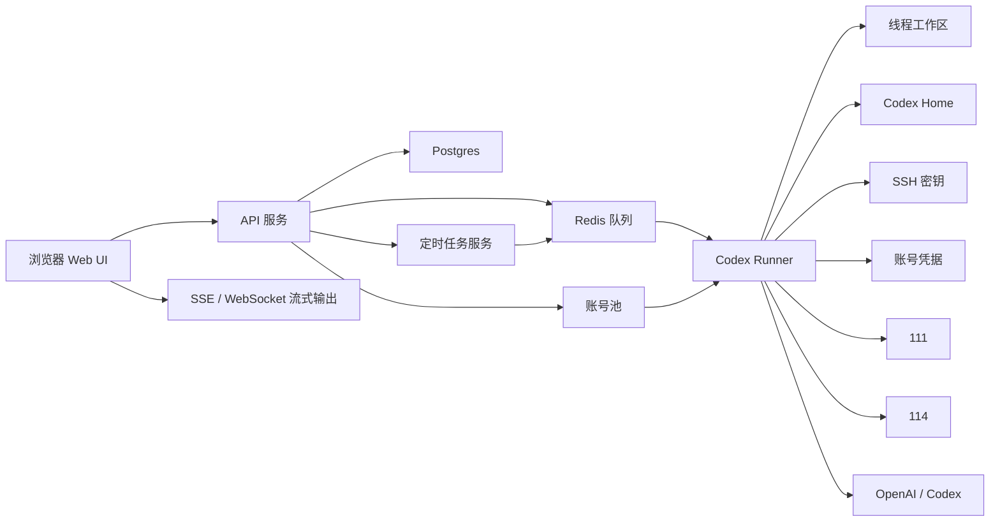

# Server Codex 中文规格说明

## 1. 项目目标

在 `150` 服务器上部署一个私有 Codex Web 控制台，提供类似 Codex 的网页对话体验，并支持多线程、多工作区、技能、插件、定时任务、远程服务器运维和账号池故障切换。

系统需要支持：

- 浏览器访问的 Codex 风格对话界面。
- 多个独立线程。
- 线程目录由服务器自动分配。
- 线程名称可在网站上修改。
- 支持 skill。
- 支持 plugin。
- 支持定时任务。
- 支持从 `150` 操作 `111` 和 `114`。
- 支持导入授权的 Codex/OpenAI 账号。
- 当某个账号不可用、认证失败或额度耗尽时，支持自动切换到其他可用账号。

账号切换只用于已授权账号之间的正常容灾和故障切换，不用于绕过平台限制。

## 2. 服务器角色

| 服务器 | SSH 别名 | 角色 |
| --- | --- | --- |
| `111` | `ecs-111` | 被管理的生产服务器 |
| `114` | `ecs-114` | 被管理的生产服务器 |
| `150` | `ecs-150` | Web 控制台、Runner、调度器、SSH 控制节点 |

`150` 是控制平面，负责运行网站、数据库、队列、定时任务、Codex Runner、账号池、密钥和线程工作目录。

## 3. 总体架构



## 4. 推荐技术栈

第一版 MVP 推荐：

- 前端：Next.js、React、TypeScript。
- 后端：Node.js，优先 Fastify 或 NestJS。
- 数据库：Postgres。
- 队列：Redis + BullMQ。
- 流式输出：优先 SSE，后续需要双向控制时再加 WebSocket。
- Runner：独立 Node worker，负责调用 Codex CLI 或 OpenAI API。
- 部署：Docker Compose。
- 反向代理：Caddy 或 Nginx。

MVP 阶段优先使用 Codex CLI 模式，因为它更容易复用本地 Codex 的 skill、plugin、shell 和文件操作能力。后续再逐步增加直接 API 模式。

## 5. 150 服务器目录规划

```text
/srv/server-codex/
  app/
  docker-compose.yml
  .env

/srv/codex/
  workspaces/
    thr_01.../
  codex-home/
    users/
      usr_01.../
    accounts/
      acct_01.../
  plugins/
    global/
    users/
  logs/
  artifacts/
  secrets/
    ssh/
    accounts/
```

规则：

- 线程显示名称可以修改。
- 真实目录名必须由服务器生成，不能使用用户输入。
- 所有敏感凭据放在 `/srv/codex/secrets` 下。
- Runner 只能挂载执行所需的工作区和密钥目录。

## 6. 核心数据模型

### 6.1 用户表

```text
users
  id
  email
  display_name
  password_hash
  role
  created_at
```

### 6.2 线程表

```text
threads
  id
  user_id
  display_name
  workspace_path
  account_mode       auto / pinned / pool
  pinned_account_id
  model
  status             idle / running / waiting_for_capacity / failed / archived
  created_at
  updated_at
```

### 6.3 消息表

```text
messages
  id
  thread_id
  role               user / assistant / system / tool
  content
  metadata_json
  created_at
```

### 6.4 运行记录表

```text
runs
  id
  thread_id
  user_id
  account_id
  status             queued / running / succeeded / failed / canceled
  error_code
  error_message
  started_at
  finished_at
```

### 6.5 服务器配置表

```text
server_profiles
  id
  name               111 / 114 / 150
  host_alias         ecs-111 / ecs-114 / local-150
  enabled
  allowed_commands_json
  created_at
```

### 6.6 审计日志表

```text
audit_logs
  id
  user_id
  thread_id
  run_id
  action
  target
  command
  exit_code
  output_ref
  created_at
```

## 7. 线程和工作区

创建线程时：

1. 生成线程 ID，例如 `thr_01HY...`。
2. 创建目录 `/srv/codex/workspaces/thr_01HY...`。
3. 将用户可修改名称保存到数据库字段 `display_name`。
4. 线程目录名不随显示名称变化。

Runner 执行时使用：

```bash
WORKDIR=/srv/codex/workspaces/{threadId}
CODEX_HOME=/srv/codex/codex-home/accounts/{accountId}
GIT_SSH_COMMAND="ssh -F /srv/codex/secrets/ssh/config"
```

同一个线程同一时间只能有一个 Runner 写入，必须加线程级锁。

## 8. 150 操作 111 和 114

不要把本地整个 `~/.ssh` 复制到 `150`。

推荐方案：

1. 在 `150` 上生成专用运维 key。
2. 把公钥加入 `111` 和 `114` 的 `authorized_keys`。
3. 只把这个专用 key 放在 `/srv/codex/secrets/ssh`。

兼容方案：

- 只复制本机访问 `111` 和 `114` 所需的私钥，不复制其他 key。

`150` 上的 SSH config：

```sshconfig
Host ecs-111
  HostName 43.155.136.111
  User ubuntu
  IdentityFile /srv/codex/secrets/ssh/ubuntu_43.155.136.111
  IdentitiesOnly yes
  StrictHostKeyChecking yes

Host ecs-114
  HostName 43.155.163.114
  User ubuntu
  IdentityFile /srv/codex/secrets/ssh/ubuntu_43.155.163.114
  IdentitiesOnly yes
  StrictHostKeyChecking yes
```

权限要求：

```bash
sudo chown -R codexsvc:codexsvc /srv/codex/secrets/ssh
sudo chmod 700 /srv/codex/secrets/ssh
sudo chmod 600 /srv/codex/secrets/ssh/config
sudo chmod 600 /srv/codex/secrets/ssh/*
```

所有 SSH 命令都要写入审计日志。

## 9. 账号池

账号池用于管理多个已授权 Codex/OpenAI 账号，并在运行任务时选择合适账号。

```text
codex_accounts
  id
  label
  email_masked
  plan_type          free / plus / pro / api / unknown
  status             active / exhausted / disabled / invalid
  priority
  current_5h_usage
  current_week_usage
  reset_5h_at
  reset_week_at
  last_used_at
  secret_ref
  created_at
  updated_at
```

支持两种凭据模式：

1. API Key 模式。
   - 适合直接 API Runner。
   - 密钥服务端加密保存。
   - 前端永远不展示完整 key。

2. Codex Home 模式。
   - 适合 CLI Runner。
   - 每个账号使用独立 `CODEX_HOME`。
   - 只导入 Codex 登录所需文件。

账号选择规则：

1. 如果线程固定账号，优先使用固定账号。
2. 否则从 `active` 账号中选择。
3. 优先级高的账号优先。
4. 当前使用量低的账号优先。
5. 同一个线程尽量保持使用同一个账号。

自动切换触发条件：

- 认证失败。
- 账号被禁用。
- 额度耗尽。
- 明确限流。
- 返回了已知容量错误。

自动切换流程：

1. 标记当前账号状态。
2. 记录切换原因。
3. 选择下一个可用账号。
4. 在安全的情况下重试当前 run。
5. 如果没有可用账号，线程进入 `waiting_for_capacity` 状态。

## 10. Skill 支持

Skill 存放位置：

```text
/srv/codex/codex-home/accounts/{accountId}/skills/
/srv/codex/codex-home/users/{userId}/skills/
```

网站功能：

- 查看已安装 skill。
- 从 Git 仓库安装 skill。
- 上传 skill 文件夹。
- 查看 `SKILL.md`。
- 启用或禁用 skill。
- 在 run 记录中保存本次可用 skill 列表。

第一版可以先用文件系统管理，后续再加数据库元信息。

## 11. Plugin 支持

Plugin 存放位置：

```text
/srv/codex/plugins/global/
/srv/codex/plugins/users/{userId}/
```

网站功能：

- 查看已安装 plugin。
- 启用或禁用 plugin。
- 配置 MCP server。
- 查看 plugin 提供的 skill 和 tool。
- 记录 plugin 调用审计日志。

Plugin 可能带来外部工具调用能力，因此启用必须显式操作。

## 12. 定时任务

```text
automations
  id
  user_id
  name
  cron_expr
  timezone
  target_thread_id
  create_new_thread
  prompt
  enabled
  last_run_at
  next_run_at
  created_at
  updated_at
```

执行流程：

1. Scheduler 扫描到期任务。
2. 将任务写入 Redis 队列。
3. Runner 执行目标线程或创建新线程。
4. 遵守线程锁。
5. 保存运行结果。
6. 按任务策略决定是否重试。

典型任务：

- 每日检查 `111` 服务状态。
- 每周验证 `114` 部署状态。
- 定时检查 saved runner 是否正常。
- 定时生成运维报告。

## 13. Web 页面

需要的主要页面：

- 线程列表。
- 线程详情。
- 当前工作区文件浏览。
- Run 日志。
- 服务器管理。
- 账号池。
- Skill 管理。
- Plugin 管理。
- 定时任务。
- 系统设置。

线程页面需要：

- 左侧线程列表。
- 新建线程。
- 线程改名。
- 线程归档。
- 对话输入框。
- 流式输出。
- 工具调用时间线。
- 命令执行状态。
- 取消当前 run。

账号池页面需要：

- 账号数量。
- 当前账号。
- 套餐标签。
- 状态。
- 用量进度。
- 重置时间。
- 导入账号。
- 禁用账号。
- 手动切换。
- 智能切换开关。

服务器页面需要：

- `111`、`114`、`150` 配置。
- 连通性检查。
- 最近执行命令。
- 允许命令策略。
- 审计日志。

## 14. 安全要求

最低安全要求：

- 必须 HTTPS。
- 必须登录。
- 使用服务端 session 或 JWT。
- 前端不返回任何完整密钥。
- SSH 私钥权限必须是 `0600`。
- `/srv/codex/secrets` 必须只有服务用户可读。
- 每个线程必须有写入锁。
- 所有 SSH 和危险命令必须审计。
- 高风险命令后续可以增加人工确认。

Runner 安全要求：

- 非 root 用户运行。
- 优先独立容器运行。
- 只挂载必要工作区和密钥。
- 设置 CPU 和内存限制。
- 部署操作尽量 pull-based，不做临时复制热修。

## 15. 部署流程

初始化 `150`：

```bash
sudo useradd -m -s /bin/bash codexsvc
sudo mkdir -p /srv/server-codex /srv/codex/{workspaces,codex-home,plugins,logs,artifacts,secrets/ssh,secrets/accounts}
sudo chown -R codexsvc:codexsvc /srv/server-codex /srv/codex
sudo chmod 700 /srv/codex/secrets
```

部署应用：

```bash
cd /srv/server-codex
git pull --ff-only
docker compose up -d --build
```

计划服务：

```text
web
api
runner
scheduler
postgres
redis
caddy
```

## 16. MVP 阶段

### 阶段 1：Web 控制台基础

- Docker Compose。
- Next.js 前端。
- API 服务。
- Postgres。
- Redis。
- 登录。
- 线程创建、列表、改名、归档。
- 自动创建工作目录。
- 消息流式输出。
- 基础 Runner 抽象。

### 阶段 2：150 运维控制节点

- SSH 密钥初始化脚本。
- 内置 `111`、`114`、`150` 服务器配置。
- 连通性检查。
- SSH 命令审计。
- Runner 可以访问 `ssh ecs-111` 和 `ssh ecs-114`。

### 阶段 3：账号池

- 账号导入模型。
- 手动切换账号。
- 线程固定账号。
- 账号状态管理。
- 安全自动切换。
- 用量和重置时间展示。

### 阶段 4：Skill 和 Plugin

- Skill 列表和导入。
- Plugin 列表和启用。
- 每账号或每用户独立 `CODEX_HOME`。
- Run 记录保存启用的 skill/plugin。

### 阶段 5：定时任务

- Cron 调度。
- 运行历史。
- 重试策略。
- 继续已有线程或创建新线程执行。
- 后续增加通知。

## 17. 待确认问题

- 第一版 Runner 是否只使用 Codex CLI？
- 本机 Codex 登录状态具体存放在哪些文件？
- `150` 操作 `111`/`114` 使用新生成专用 key，还是复制现有 key？
- 哪些命令需要人工确认？
- MVP 是否只做单用户？
- 账号池第一版是否先只做手动导入和手动切换？
